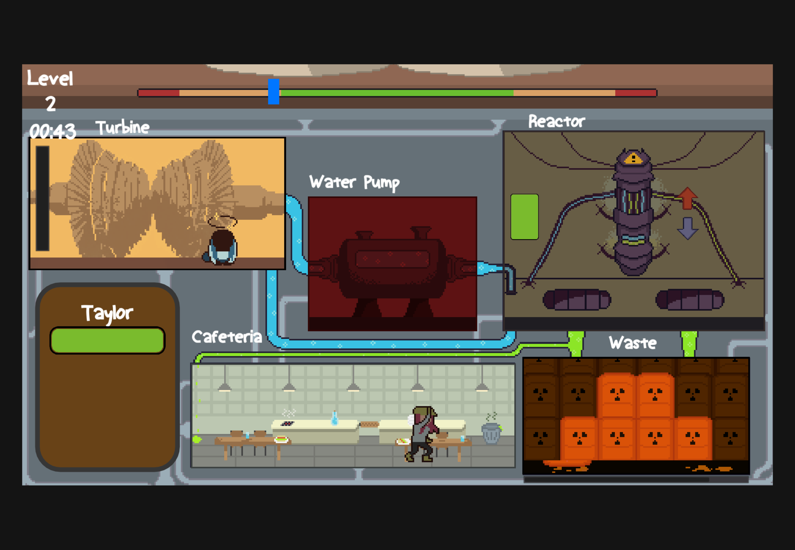
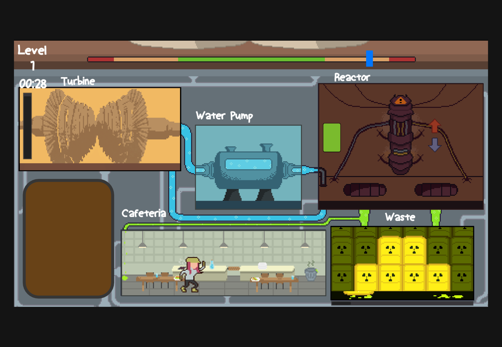

## Ultimate Efficiency

*Made in 48 hours for Global Game Jam 2021*

In this heart-thumping nuclear power plant manager, ensure you don't lose your power output while finding the balance of your hopeless employees. Drag and drop your flailing employees to repair broken rooms, fling waste out of the window, and stop mayhem from unraveling the power plant!

**Download on itch.io:**
https://ajweeks.itch.io/ultimate-efficiency

Made in 48 hours for Global Game Jam 2021 at the (virtual) Brighton jam site in South England.

|Team|
|---------------------------------------------|
|☢ [Erik Ľuboš Selecký](https://seleckye.com/)|
|☢ [Eric Drößiger](https://ericmakes.games/)|
|☢ Karolina "Toaster" Machnik|
|☢ [Ben](https://benlandor.com/)|
|☢ [AJ Weeks](https://ajweeks.com/)|

**Jam page:**
https://globalgamejam.org/2021/games/ultimate-efficiency-9

Made using Godot 3.2

**Screenshots:**

